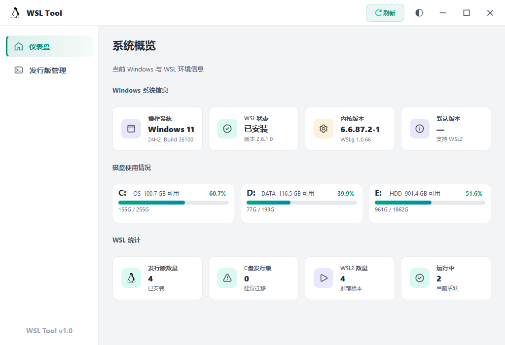

# WSL 管理工具 (WSL Manager)



**一款面向 Windows 用户的 WSL 发行版可视化管理与迁移工具**

[功能特性](#功能特性) · [快速开始](#快速开始) · [构建指南](#构建指南) · [项目结构](#项目结构) · [常见问题](#常见问题)

</div>

---

## 简介

WSL 管理工具（WSLTool）是一款基于 **Qt 5 / C++17** 开发的 Windows 桌面应用，帮助用户以图形化方式管理 Windows Subsystem for Linux（WSL）发行版。核心功能包括：发行版信息浏览、磁盘占用分析、**一键将 WSL 迁移到其他磁盘分区**，解决 C 盘空间告急问题。

---

## 功能特性

| 功能 | 说明 |
| --- | --- |
| 📊 **仪表盘** | 展示系统信息、WSL 版本、磁盘使用率概览 |
| 🐧 **发行版管理** | 枚举所有已安装的 WSL 发行版，显示版本、状态、路径、体积 |
| 🚚 **迁移向导** | 以向导形式将 WSL 发行版从 C 盘迁移至任意目标磁盘 |
| 📈 **实时进度** | 迁移过程分步显示进度、日志，支持取消操作 |
| 🔄 **账户配置** | 迁移时可选配置新用户名与密码 |
| 🛡️ **自动提权** | 检测管理员权限并通过自定义 UI 申请提权重启 |
| 🎨 **深/浅主题** | 内置 QSS 深色与浅色主题，一键切换，Segoe UI 字体 |
| 🖥️ **系统托盘** | 关闭窗口最小化到托盘，支持右键菜单和双击恢复 |
| 🔒 **单例运行** | 禁止多开，第二次运行自动唤醒已有窗口 |
| ⚠️ **免责声明** | 首次运行显示操作风险免责声明，防止误操作 |

---

## 系统要求

| 项目 | 要求 |
| ---- | --- |
| 操作系统 | Windows 7 SP1 及以上（x64） |
| WSL | 已启用 WSL 功能，推荐 WSL 2 |
| 权限 | **管理员权限**（必需，用于读取注册表与执行迁移） |
| 运行时 | 无需额外安装（安装包已捆绑 Qt 运行时） |

---

## 快速开始

### 方式一：使用安装包（推荐）

1. 从 [Releases](#) 下载最新的 `WSLTool_v1.0.0_Setup.exe`
2. 运行安装程序（会提示 UAC 权限）
3. 按向导完成安装
4. 首次启动会显示免责声明，阅读并接受后进入主界面

### 方式二：直接运行（便携版）

1. 将 `build/release/` 目录下的所有文件解压到任意目录
2. 双击 `WSLTool.exe`（程序会自动申请管理员权限）

> ⚠️ **注意**：程序需要管理员权限，manifest 已声明 `requireAdministrator`，Windows 会自动弹出 UAC 提权。

---

## 使用说明

### 仪表盘

启动后自动检测系统环境，展示：

- Windows 版本与系统架构
- WSL 版本信息
- 各磁盘分区使用率（带可视化进度条）

### 发行版列表

切换到"发行版"页面，查看所有已安装 WSL 发行版的卡片，包含：

- 发行版名称与版本（WSL 1 / WSL 2）
- 运行状态（运行中 / 已停止）
- 安装路径与 VHDX 文件大小
- 是否位于 C 盘（高亮提示）

### 迁移向导

1. 点击发行版卡片上的 **"迁移"** 按钮
2. 在向导中选择目标磁盘目录
3. 可选：配置新用户名与密码
4. 确认后开始迁移，实时查看步骤进度与日志

**迁移步骤：**

1. 停止 WSL 发行版
2. 导出（`wsl --export`）到临时 tar 文件
3. 注销原发行版（`wsl --unregister`）
4. 导入到目标路径（`wsl --import`）
5. 配置用户账户（可选）
6. 清理临时文件

> 💡 **提示**：迁移过程中如遇错误，工具会尝试自动回滚以保护数据安全。

### 系统托盘

- 点击关闭按钮 → 程序隐藏到系统托盘
- 右键托盘图标 →「显示主页面」或「关闭退出程序」
- 双击托盘图标 → 恢复窗口显示
- **单例保护**：再次运行程序会自动激活已有窗口

---

## 构建指南

### 前置依赖

- **Qt 5.15.2**（MinGW 8.1.0 x64）
  - 安装路径：`C:\Qt\5.15.2\mingw81_64`
- **MinGW 8.1.0 x64**
  - 工具路径：`C:\Qt\Tools\mingw810_64`
- （可选）**Inno Setup 6.x**（用于打包安装程序）

### 使用构建脚本

```bat
:: 在项目根目录运行
build.bat
```

构建脚本将依次执行：

1. `qmake` 生成 Makefile
2. `mingw32-make` 多核并行编译
3. `windeployqt` 收集 Qt 运行时依赖

编译产物位于 `build/release/WSLTool.exe`。

### 手动构建

```bat
set QT_DIR=C:\Qt\5.15.2\mingw81_64
set PATH=%QT_DIR%\bin;C:\Qt\Tools\mingw810_64\bin;%PATH%

mkdir build\release
cd build\release
qmake ..\..\WSLTool.pro -spec win32-g++ "CONFIG+=release"
mingw32-make -j4
windeployqt --release WSLTool.exe
```

### 打包安装程序

确保已完成构建，然后用 Inno Setup 编译 `installer/WSLTool_Setup.iss`：

```bat
"C:\Program Files (x86)\Inno Setup 6\ISCC.exe" installer\WSLTool_Setup.iss
```

生成的安装包位于 `installer/WSLTool_v1.0.0_Setup.exe`。

---

## 项目结构

```
WSLTool/
├── WSLTool.pro                  # Qt 项目配置文件（QT += core gui widgets concurrent svg network）
├── build.bat                    # 一键构建脚本（含 pause 保留窗口）
├── build/
│   └── release/                 # 编译输出目录
├── installer/
│   └── WSLTool_Setup.iss        # Inno Setup 安装脚本
├── resources/
│   ├── resources.qrc            # Qt 资源描述文件
│   ├── app.rc                   # Windows 资源文件（图标、清单）
│   ├── app.manifest             # UAC 管理员权限声明（requireAdministrator）
│   ├── app_icon.ico             # 应用图标
│   ├── icons/                   # UI 图标资源
│   └── styles/
│       ├── dark_theme.qss       # 全局深色主题样式表
│       └── light_theme.qss      # 全局浅色主题样式表
└── src/
    ├── main.cpp                 # 程序入口（单例检测、UAC 提权、主题加载）
    ├── mainwindow.h/cpp         # 主窗口（无边框拖拽、侧边栏导航、系统托盘）
    ├── core/                    # 核心业务逻辑
    │   ├── wslmanager           # WSL 发行版枚举与管理
    │   ├── migrationworker      # 迁移任务工作线程
    │   ├── systemdetector       # 系统环境检测
    │   └── diskmanager          # 磁盘信息采集
    ├── models/                  # 数据模型
    │   ├── wsldistribution.h    # WSL 发行版数据结构
    │   ├── diskinfo.h           # 磁盘信息数据结构
    │   └── systeminfo.h         # 系统信息数据结构
    └── ui/                      # 界面组件
        ├── dashboardpage        # 仪表盘页面
        ├── distributionpage     # 发行版列表页面
        ├── migrationdialog      # 迁移配置向导对话框
        ├── migrationprogressdialog  # 迁移进度对话框
        ├── disclaimerdialog     # 首次启动免责声明
        ├── elevationdialog      # 管理员权限申请（自定义 UI）
        └── widgets/
            ├── distrocard       # 发行版卡片组件
            ├── diskusagebar     # 磁盘使用率进度条（paintEvent 自定义绘制）
            ├── infocard         # 信息展示卡片
            └── sidebarbutton    # 侧边栏导航按钮
```

---

## 技术栈

- **语言**：C++17
- **框架**：Qt 5.15.2（Widgets、Concurrent、Network）
- **编译器**：MinGW-w64 8.1.0
- **Windows API**：WinAPI（注册表、进程管理、磁盘信息）、WMI、Shell API
- **IPC**：QLocalServer / QLocalSocket（单例通信）
- **打包**：windeployqt + Inno Setup 6
- **子系统**：`CONFIG += windows`（无控制台窗口）

---

## 常见问题

**Q: 程序闪退或无法启动？**  
A: 确保以管理员身份运行。manifest 已声明 `requireAdministrator`，双击会自动触发 UAC 提权。

**Q: 找不到我的 WSL 发行版？**  
A: 程序通过注册表路径 `HKCU\Software\Microsoft\Windows\CurrentVersion\Lxss` 枚举发行版。请确认 WSL 已正确安装且发行版注册表项存在。

**Q: 迁移失败后数据丢失？**  
A: 工具在迁移失败时会尝试自动回滚（重新注册原发行版）。**强烈建议迁移前手动备份重要数据**（`wsl --export <名称> backup.tar`）。

**Q: 迁移后 WSL 启动报错？**  
A: 检查目标路径是否存在权限问题，尝试在 PowerShell（管理员）中手动执行 `wsl -d <发行版名称>` 验证。

**Q: 支持 WSL 1 迁移吗？**  
A: 支持，WSL 1 与 WSL 2 均可迁移。WSL 2 使用 VHDX 虚拟磁盘，文件更大但迁移机制相同。

**Q: 关闭窗口后怎么找回程序？**  
A: 程序关闭按钮默认最小化到系统托盘（任务栏右下角）。右键托盘图标选择「显示主页面」或双击图标即可恢复。

**Q: 重复运行程序会怎样？**  
A: 程序内置单例检测，第二次运行会自动激活已有窗口并退出。

---

## 贡献

欢迎提交 Issue 和 Pull Request！在提交 PR 前，请：

1. Fork 本仓库
2. 创建功能分支：`git checkout -b feature/your-feature`
3. 提交更改：`git commit -m 'feat: add your feature'`
4. 推送分支：`git push origin feature/your-feature`
5. 创建 Pull Request

---

## 许可证

本项目基于 [MIT License](LICENSE) 开源。

---

<div align="center">
  如果本工具对你有帮助，欢迎 ⭐ Star 支持！
</div>
